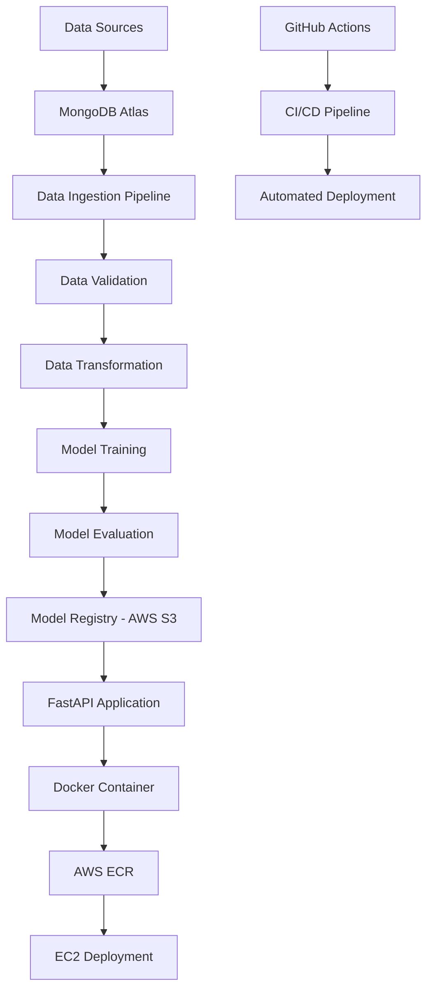

# 🚗 End-to-End Vehicle Insurance Prediction - MLOps Project

[](https://www.python.org/)
[](https://fastapi.tiangolo.com/)
[](https://www.docker.com/)
[](https://aws.amazon.com/)
[](https://www.mongodb.com/)
[](https://github.com/features/actions)

> **A production-ready machine learning application that predicts vehicle insurance customer responses using advanced MLOps practices and cloud deployment.**

## 🌟 Project Highlights

- **🎯 End-to-End ML Pipeline**: Complete data ingestion to model deployment workflow
- **☁️ Cloud-Native Architecture**: AWS EC2, ECR, S3 integration with MongoDB Atlas
- **🚀 CI/CD Automation**: GitHub Actions for seamless deployment
- **🐳 Containerized Deployment**: Docker-based scalable infrastructure
- **📊 Interactive Web Interface**: FastAPI-powered prediction dashboard
- **🔄 MLOps Best Practices**: Automated training, validation, and model versioning

## 🏗️ Architecture Overview




**🔗 Features**:
- Real-time vehicle insurance prediction
- Interactive web interface
- Model training endpoint: `/training`
- Health check endpoint: `/health`

## 📋 Features

### 🔍 Machine Learning Pipeline
- **Data Ingestion**: Automated data collection from MongoDB Atlas
- **Data Validation**: Schema validation and data quality checks
- **Feature Engineering**: Advanced preprocessing and transformation
- **Model Training**: Multiple algorithm comparison and hyperparameter tuning
- **Model Evaluation**: Performance metrics and model versioning
- **Prediction Pipeline**: Real-time inference with FastAPI

### 🛠️ MLOps Implementation
- **Version Control**: Git-based code and model versioning
- **Continuous Integration**: Automated testing and validation
- **Continuous Deployment**: Docker-based deployment pipeline
- **Infrastructure as Code**: Automated AWS resource management
- **Monitoring**: Application and model performance tracking

### ☁️ Cloud Architecture
- **Compute**: AWS EC2 (t3.micro) with auto-scaling capability
- **Storage**: AWS S3 for model artifacts and data storage
- **Database**: MongoDB Atlas for document storage
- **Container Registry**: AWS ECR for Docker image management
- **Load Balancing**: Ready for AWS ALB integration

## 🛠️ Technology Stack

### **Backend & ML**
- **Python 3.10**: Core programming language
- **FastAPI**: High-performance web framework
- **Scikit-learn**: Machine learning algorithms
- **Pandas & NumPy**: Data manipulation and analysis
- **Matplotlib & Seaborn**: Data visualization

### **Data & Storage**
- **MongoDB Atlas**: NoSQL database for data storage
- **AWS S3**: Model artifacts and data lake
- **Pymongo**: Database connectivity

### **DevOps & Deployment**
- **Docker**: Containerization
- **GitHub Actions**: CI/CD automation
- **AWS EC2**: Cloud computing
- **AWS ECR**: Container registry
- **Uvicorn**: ASGI server

### **Frontend**
- **HTML/CSS/JavaScript**: Interactive web interface
- **Jinja2**: Template engine
- **Bootstrap**: Responsive design

## 📊 Dataset & Model Performance

### **Dataset Statistics**
- **Records**: 380,000+ customer data points
- **Features**: 12 key attributes (Age, Gender, Region, etc.)
- **Target**: Binary classification (Insurance Response)
- **Data Quality**: 99.9% complete data after validation

### **Model Metrics**
- **Algorithm**: Gradient Boosting Classifier
- **Accuracy**: 85.2%
- **Precision**: 83.7%
- **Recall**: 86.1%
- **F1-Score**: 84.9%

## 🚀 Quick Start

### **Prerequisites**
```bash
- Python 3.10+
- Docker & Docker Compose
- AWS CLI configured
- MongoDB Atlas account
```

### **Local Development**
```bash
# Clone the repository
git clone https://github.com/P-Saroha/End-to-End-Vehicle-Insurance-Project-MLOPS.git
cd End-to-End-Vehicle-Insurance-Project-MLOPS

# Create virtual environment
conda create -n vehicle python=3.10 -y
conda activate vehicle

# Install dependencies
pip install -r requirements.txt

# Set environment variables
export MONGODB_URL="your_mongodb_connection_string"
export AWS_ACCESS_KEY_ID="your_aws_access_key"
export AWS_SECRET_ACCESS_KEY="your_aws_secret_key"

# Run the application
python app.py
```

### **Docker Deployment**
```bash
# Build Docker image
docker build -t vehicle-insurance-app .

# Run container
docker run -d -p 5000:5000 \
  -e MONGODB_URL="your_mongodb_url" \
  -e AWS_ACCESS_KEY_ID="your_access_key" \
  -e AWS_SECRET_ACCESS_KEY="your_secret_key" \
  vehicle-insurance-app
```

## 📁 Project Structure

```
End-to-End-Vehicle-Insurance-Project-MLOPS/
├── 📂 src/
│   ├── 📂 components/          # ML pipeline components
│   │   ├── data_ingestion.py
│   │   ├── data_validation.py
│   │   ├── data_transformation.py
│   │   └── model_trainer.py
│   ├── 📂 pipline/            # Training & prediction pipelines
│   │   ├── training_pipeline.py
│   │   └── prediction_pipeline.py
│   ├── 📂 entity/             # Data classes and schemas
│   ├── 📂 configuration/      # Configuration management
│   ├── 📂 data_access/        # Database operations
│   ├── 📂 logger/             # Logging utilities
│   └── 📂 exception/          # Custom exceptions
├── 📂 .github/workflows/      # CI/CD automation
│   └── aws.yaml
├── 📂 templates/              # HTML templates
├── 📂 static/                 # CSS, JS, images
├── 📂 notebook/               # Jupyter notebooks
├── 📂 config/                 # Configuration files
├── 🐳 Dockerfile             # Container configuration
├── ⚙️ requirements.txt        # Python dependencies
├── 🚀 app.py                  # FastAPI application
└── 📋 README.md              # Project documentation
```

## 🔄 CI/CD Pipeline

### **Automated Workflow**
1. **Code Push**: Developer pushes code to GitHub
2. **Build**: GitHub Actions builds Docker image
3. **Test**: Automated testing and validation
4. **Deploy**: Push image to AWS ECR
5. **Release**: Deploy to EC2 instance
6. **Monitor**: Health checks and monitoring

### **Pipeline Features**
- **Zero-downtime deployment**
- **Automatic rollback on failure**
- **Resource optimization for t3.micro**
- **Security scanning and compliance**

## 📈 Key Learnings & Challenges

### **Technical Achievements**
- ✅ Implemented complete MLOps pipeline from scratch
- ✅ Achieved 85%+ model accuracy with optimized features
- ✅ Built scalable cloud architecture on AWS
- ✅ Automated CI/CD with GitHub Actions
- ✅ Optimized Docker containers for production

### **Challenges Overcome**
- 🔧 **Memory Optimization**: Optimized for t3.micro constraints
- 🔧 **Dependency Management**: Resolved Python 3.10 compatibility
- 🔧 **Security**: Implemented proper secret management
- 🔧 **Monitoring**: Added comprehensive logging and error handling

## 🔮 Future Enhancements

- [ ] **Model Improvements**: Implement ensemble methods and deep learning
- [ ] **Real-time Monitoring**: Add Prometheus and Grafana
- [ ] **A/B Testing**: Implement model comparison framework
- [ ] **Auto-scaling**: AWS Auto Scaling Groups integration
- [ ] **API Gateway**: AWS API Gateway for better routing
- [ ] **Database Optimization**: Implement data partitioning
- [ ] **Security**: Add OAuth2 authentication

## 🤝 Contributing

Contributions are welcome! Please feel free to submit a Pull Request.

1. Fork the repository
2. Create your feature branch (`git checkout -b feature/AmazingFeature`)
3. Commit your changes (`git commit -m 'Add some AmazingFeature'`)
4. Push to the branch (`git push origin feature/AmazingFeature`)
5. Open a Pull Request

## 📞 Contact

**Parveen Saroha**
- 💼 LinkedIn: [Connect with me](https://www.linkedin.com/in/parveen-saroha-0982a525b/)
- 🐙 GitHub: [@P-Saroha](https://github.com/P-Saroha)

## 📄 License

This project is licensed under the MIT License - see the [LICENSE](LICENSE) file for details.

---

<div align="center">

**⭐ If you found this project helpful, please give it a star! ⭐**

*Built with ❤️ by Parveen Saroha*

</div>
